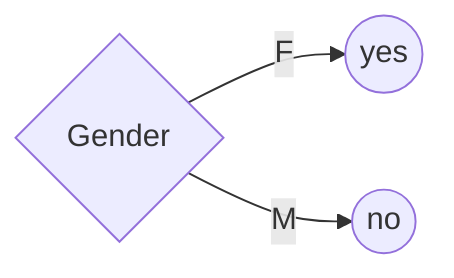
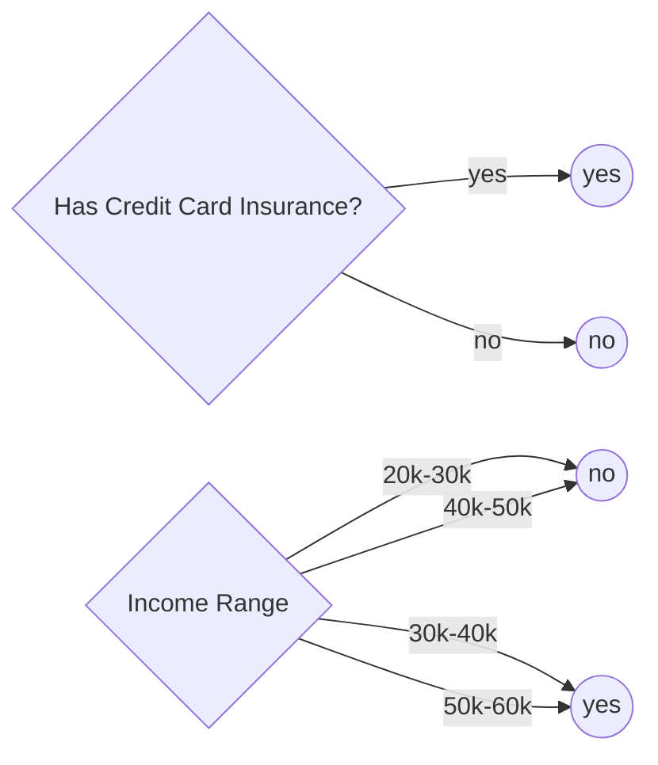
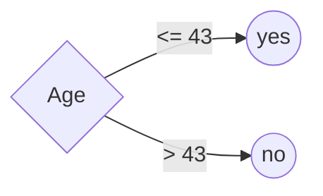

# 1R classification algorithm

**1R** is a simple [classification learning](ml-supervised-classification-learning.md) algorithm that develops a set of rules from a single input attribute (hence "1" for the number of inputs and "R" for "rules"). The algorithm works by looking at an attribute of a given data set and producing a rule based on that attribute to predict the outcome. This process is repeated for each attribute to create a complete rule set.

## 1R classification example

<iframe width="560" height="315" src="https://www.youtube.com/embed/bAqU3-1FsPA" title="YouTube video player" frameborder="0" allow="accelerometer; autoplay; clipboard-write; encrypted-media; gyroscope; picture-in-picture" allowfullscreen></iframe>

Consider the following training dataset which we want to use to train our model to predict whether a credit card customer will respond to a life insurance promotion:

| Age | Gender | Income Range | Has Credit Card Insurance | Life Insurance Promotion |
| --- | ------ | ------------ | ------------------------- | ------------------------ |
| 45  | M      | 40k-50k      | no                        | no                       |
| 40  | F      | 30k-40k      | no                        | yes                      |
| 42  | M      | 40k-50k      | no                        | no                       |
| 43  | M      | 30k-40k      | yes                       | yes                      |
| 38  | F      | 50k-60k      | no                        | yes                      |
| 55  | F      | 20k-30k      | no                        | no                       |
| 35  | M      | 30k-40k      | yes                       | yes                      |
| 27  | M      | 20k-30k      | no                        | no                       |
| 43  | M      | 30k-40k      | no                        | no                       |
| 41  | F      | 30k-40k      | no                        | yes                      |
| 43  | F      | 40k-50k      | no                        | yes                      |
| 29  | M      | 20k-30k      | no                        | yes                      |
| 39  | F      | 50k-60k      | no                        | yes                      |
| 55  | M      | 40k-50k      | no                        | no                       |
| 19  | F      | 20k-30k      | yes                       | yes                      |

Looking at `Gender`, the majority (6 out of 7) females responded to the life insurance promotion while the majority (6 out of 8) of males did not. This creates the following rules for gender:

The accuracy rate on this rule is the number of accurate predictions, divided by the total number of predictions, or $(6+5)/15 = 11/15 \approx 73\%$

This process is repeated for `Has Credit Card Insurance` and `Income Range`, which derives the following rules:

Note that the `Has Credit Card Insurance` attribute has an equal number of each outcome for `no` values (6 `no` values result in a `yes` and 6 `no` values result in a `no`). To resolve this, we break the tie in the way we deem most appropriate. In this case we already determined that `yes` predicts `yes` with $100\%$ accuracy, thus it makes sense that `no` would predict `no` in this case.

Note the accuracy for each rule is as follows:

| Rule                      | Accuracy |
| ------------------------- | -------- |
| Gender                    | 73%      |
| Has Credit Card Insurance | 60%      |
| Income Range              | 73%      |

Age is treated differently because it is a numeric value. Numeric values are **discretized** into ranges of values, sometimes called **sub-ranges**, **bins**, or **buckets**. Though there are multiple ways to discretize, one of the simplest is to sort the data and then split it wherever makes the most accurate prediction.

Using the above sample data, we can arrange it by age and whether they responded to the life insurance promotion:

| Age | Life Insurance Promotion |
| --- | ------------------------ |
| 19  | yes                      |
| 27  | no                       |
| 29  | yes                      |
| 35  | yes                      |
| 38  | yes                      |
| 39  | yes                      |
| 40  | yes                      |
| 41  | yes                      |
| 42  | no                       |
| 43  | yes                      |
| 43  | yes                      |
| 43  | no                       |
| 45  | no                       |
| 55  | no                       |
| 55  | no                       |

Note that if we split it roughly in half, between age $40$ and $41$, the accuracy of the resulting rule (where `< 40 ➡ yes` and `> 40 ➡ no`) would be $6+5/15 \approx 73\%$. However, if we split the data between $43$ and $45$, the accuracy rises to $80\%$ ($12/15$ accurate predictions). Thus we end up with the rule:

## Using 1R to create a decision tree

<iframe width="560" height="315" src="https://www.youtube.com/embed/DNnbnSvZObQ" title="YouTube video player" frameborder="0" allow="accelerometer; autoplay; clipboard-write; encrypted-media; gyroscope; picture-in-picture" allowfullscreen></iframe>

<!-- TODO: Expand on this -->