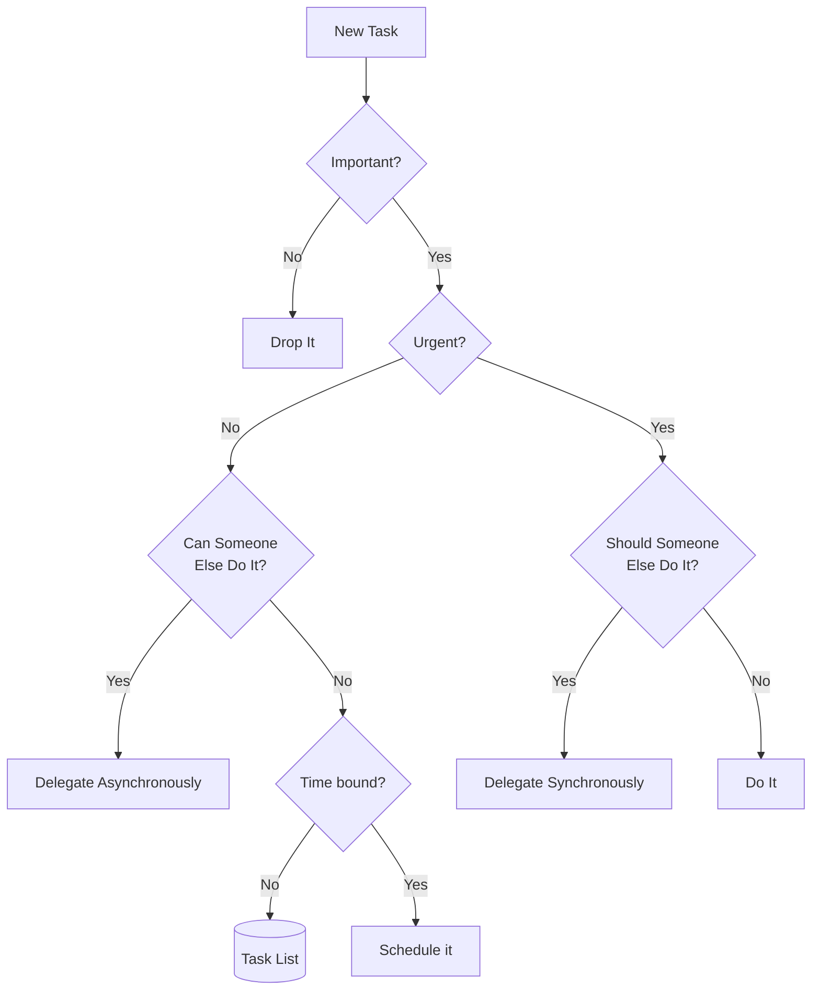

# Delegate, Do, Defer, Drop

**4D Time Management** is a decision framework to triage incoming tasks from "Getting Things Done: The Art of Stress-Free Productivity" by David Allen. Tasks might come from email, chat, phone calls, and other places. Handling the task quickly can help keep focus on priorities and help reduce distractions.

The following flow-chart combines 4D Time Management with [Stephen Covey's Time Management Matrix](covey-time-management-matrix.md) from his [Seven Habits](7-habits.md) book.

