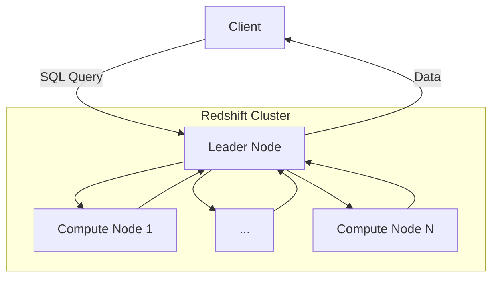

# Amazon Redshift

**Amazon Redshift** is a [columnar](columnar-databases.md) [data warehouse](data-warehouses.md) solution on [AWS](aws.md) that supports PostgreSQL queries. As a managed service, it simplifies automation of tasks such as backups, replication, and auto-scaling. **Amazon Redshift Spectrum** extends Redshift to allow querying of S3 buckets so that data does not need to be loaded directly into a Redshift database.

A key difference between Redshift and relational [databases](databases.md) is that it uses a columnar architecture, which means that data is stored by column rather than by row.

## Redshift Architecture

A Redshift cluster consists of a leader node and one or more compute nodes. Queries to Redshift are sent to the leader node's SQL endpoint, which breaks the work down into jobs that are forwarded to the compute nodes where they are processed in parallel.

## Amazon Redshift Resources

* [Amazon Redshift Homepage](https://aws.amazon.com/redshift/)
* [Amazon Redshift Documentation](https://docs.aws.amazon.com/redshift/index.html)
* [Redshift high-level System Architecture](https://docs.aws.amazon.com/redshift/latest/dg/c_high_level_system_architecture.html)
* [Redshift Pricing Guide](https://aws.amazon.com/redshift/pricing/)
