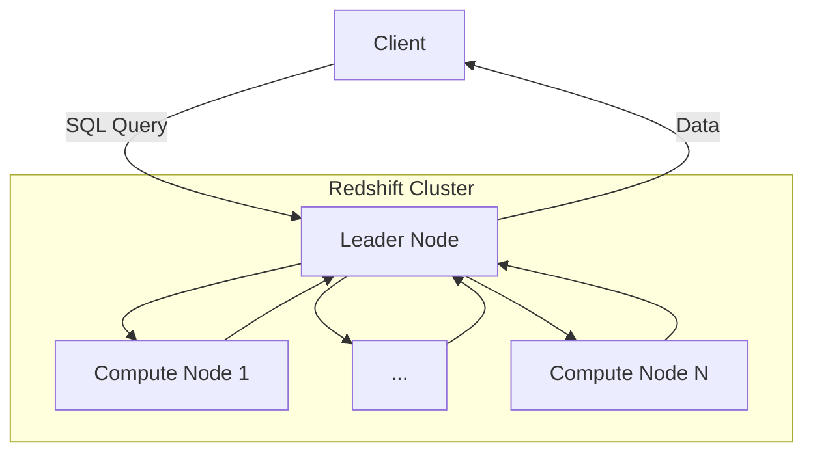

# Amazon Redshift

**Amazon Redshift** is a [columnar](columnar-databases.md) [data warehouse](data-warehouses.md) solution on [AWS](aws.md) that supports PostgreSQL queries. As a managed service, it simplifies automation of tasks such as backups, replication, and auto-scaling. **Amazon Redshift Spectrum** extends Redshift to allow querying of S3 buckets so that data does not need to be loaded directly into a Redshift database.

A key difference between Redshift and relational [databases](databases.md) is that it uses a columnar architecture, which means that data is stored by column rather than by row.

## Redshift architecture

A Redshift cluster consists of a leader node and one or more compute nodes. Queries to Redshift are sent to the leader node's SQL endpoint, which breaks the work down into jobs that are forwarded to the compute nodes where they are processed in parallel.

## Redshift table design

A well designed Redshift table will ensure even distribution of data across nodes so that jobs executed by each node will complete at roughly the same time. Data should also be sorted to minimize the need for table scans. Data may also be compressed to reduce disk space requirements and minimize I/O.

### Table distribution styles

| Style  | Description                                                         | Benefits                                       | Drawbacks                         |
| ------ | ------------------------------------------------------------------- | ---------------------------------------------- | --------------------------------- |
| `ALL`  | Each node contains the full table                                   | Maximizes performance                          | Requires excessive storage        |
| `AUTO` | Use `ALL` initially, switch to `EVEN` when the table gets too large | Balances trade-offs between `ALL` and `EVEN`   | Can be the "worst of both worlds" |
| `EVEN` | Data is round-robin partitioned                                     | Ensures even distribution of data across nodes | Poor join performance             |
| `KEY`  | Data is distributed based on a table colum                          | Balances performance with storage              | Requires evenly distributed data  |

#### The `ALL` distribution style

The `ALL` distribution style stores the full table on each node. While this can improve performance dramatically, it can also increase storage needs dramatically.

Use the `ALL` distribution style for:

- Smaller, frequently used dimension tables
- Tables where performance is critical

#### The `AUTO` distribution style

The `AUTO` distribution style is the default style used by Redshift and uses `ALL` initially, then switches to `EVEN` when the table gets too large. Once the table is switched to `EVEN`, it will not revert to `ALL` even if the table size decreases.

#### The `EVEN` distribution style

The `EVEN` distribution style distributes data evenly across all nodes in round-robin fashion, ensuring an even but essentially random distribution.

Use the `EVEN` distribution style for:

- Tables that aren't usually joined with other tables
- When you can't decide between other distribution styles

#### The `KEY` distribution style

The `KEY` distribution style distributes data across nodes based on values from one column, referred to as the **distribution key column**. All records with the same value for the distribution column will be stored on the same node (the column names do not need to match, only the values). The same distribution pattern applies for other tables with the same distribution key column value which can improve performance through a reduced need for communication across nodes.

Use the `KEY` distribution styles for:

- Keys that are evenly distributed

### Sort strategies

In Redshift, a **sort key** specifies the order in which data is stored on disk. Each table can specify one of three sort options:

| Strategy              | Description                                                                            |
| --------------------- | -------------------------------------------------------------------------------------- |
| `sortkey` (simple)    | Data is sorted by a single column                                                      |
| `compound sortkey`    | Data is hierarchically sorted by multiple columns                                      |
| `interleaved sortkey` | Data is independently sorted by multiple columns (this requires additional disk space) |

Interleaved sorted tables tend to perform worse for queries that filter by the simple or compound sort-keys, as long as the filters make use of the hierarchy defined by compound keys, due to it's more complex storage structure. However, virtually all other filters will perform better with an interleaved sort-key with the trade-off that additional storage space is required.

<!-- TODO: More content

## User Defined Functions 

## Workload Management
-->

## Amazon Redshift Resources

- [Amazon Redshift Homepage](https://aws.amazon.com/redshift/)
- [Amazon Redshift Documentation](https://docs.aws.amazon.com/redshift/index.html)
- [Redshift high-level System Architecture](https://docs.aws.amazon.com/redshift/latest/dg/c_high_level_system_architecture.html)
- [Redshift Pricing Guide](https://aws.amazon.com/redshift/pricing/)
- [Redshift Best Practices](https://aws.amazon.com/blogs/big-data/10-best-practices-for-amazon-redshift-spectrum/)
