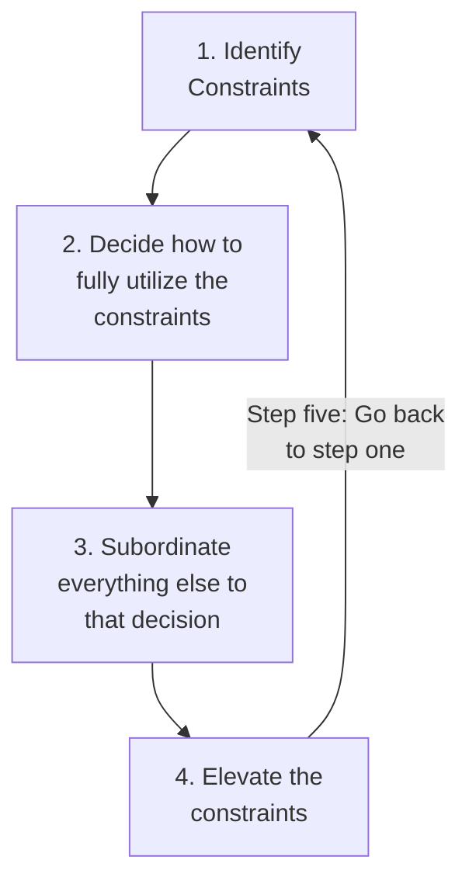

# The Goal: A Business Graphic Novel

**The Goal: A Business Graphic Novel** is an adaptation of the book **The Goal: A Process of Ongoing Improvement** by Dwight Jon Zimmerman and Dean Motter.

## Key Lessons from The Goal

**The Goal is to make money** (this is a business book, after all). To remain competitive, businesses must continuously and systematically improve their operations. The theory of constraints provides a model to continuously identify and improve systems as they relate to The Goal.

The theory of constraints defines a model of how cash flows through a system:

* **Throughput** is the rate at which a system generates money through sales.
* **Inventory** is all of the money a system has invested in purchasing things it intends to sell but hasn't sold; this includes anything from raw materials to finished products.
* **Operational expenses** are all of the money a system spends in order to convert _inventory_ to _throughput_.

In short: Throughput is money in, inventory is money out, and operational expenses are money that is "stuck" in the system.

The process of converting inventory to throughput is constrained by one or more bottlenecks. A **bottleneck** is a resource with less capacity than the demand placed upon it. Bottlenecks aren't good or bad, they're reality.

"The Goal" (to make money) therefore translates to _increasing throughput while reducing inventory and operational expenses simultaneously_.  Numbers not based on the constraints of the system are meaningless; _producing_ work and _profiting_ from it are two very different things.

A critical mistake many companies make is to optimize throughput, inventory, or operational expenses in isolation which can harm the system as a whole. For example, a reduction in operational expenses may look like a success "on paper" but if it leads to quality issues and an increase in returns, the system is not improved.

### Continuous Improvement with the Theory of Constraints

Time lost on a bottleneck directly equates to _reduced throughput_ and includes defects produced both by the bottleneck and prior to the bottleneck because defective throughput will have to pass through the bottleneck again.

Bottleneck cost ($c$) is the system's total expenses ($\$$), divided by the bottleneck's production hours ($h$), or $c = \$/h$. For example, if a system's total expenses are \$1,000,000/year and a bottleneck is operational for 7,200 hours/year, the bottleneck cost is $\$1,000,000/7,200 hours = ~\$139/year$. Note that as utilization of the bottleneck decreases, the cost to the system increases.

#### Ways to Get the Most from a Bottleneck

* Reduce defects processed by the bottleneck
* Reduce idle time of the bottleneck (but not at the expense of maintenance!)
* Prioritize only what contributes to _throughput_, not to _inventory_
* Distribute or reduce the load through alternative processes

It's okay to slow down steps that proceed the bottleneck to reduce defects sent to the bottleneck or to "get around" the bottleneck, as long as those steps do not become slower than the bottleneck (thus becoming the bottleneck). 

When a bottleneck's predecessor exceeds throughput, inventory is created; inventory increases tend to increase operational expenses as well. Running a non-bottleneck at maximum capacity is therefore a waste. Only bottlenecks should be utilized to full capacity. To "subordinate non-bottleneck resources to bottlenecks" is to run non-bottleneck resources at the rate of throughput as constrained by the bottleneck.

### Theory of Constraints: Focus Steps

