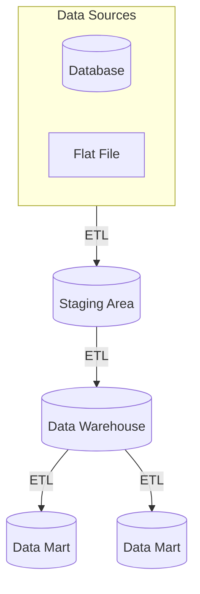

# Data warehouses

A **data warehouse** is a type of [data product](data-products.md) that consists a [database](databases.md) that stores data accumulated from a wide range of sources and stored for efficient retrieval for [analysis](data-analysis.md). Data warehouses are generally structured for [**online analytical processing (OLAP)**](olap.md) to allow for multiple data views, filters, and refinements based on multiple **dimensions**, which are attributes of interest to the business. This is most commonly achieved by implementing a [**star schema**](star-schemas.md), which uses a [relational model](relational-databases.md) to organize data into facts and dimensions.

A typical data warehouse architecture consists of multiple data sources, a staging area, the warehouse its self, and one or more data marts.

Data is extracted, transferred, and loaded from source to destination by [ETL](etls.md) processes, the sum of which constitute a [**data pipeline**](data-pipelines.md). Subsets of the data in a data warehouse are sometimes broken down into **data marts**, which are essentially "miniature data warehouses" intended for a specific audience.

The **data staging area** is a temporary storage area for source data that helps quickly extract and consolidate source data, perform quality checks and cleansing, detecting changes, troubleshooting, and performing pre-aggregation functions before the data is transferred to the data warehouse. Staging areas are often ephemeral, though they may be maintained or archived. In modern data warehouse architecture, the staging area is often a [data lake](data-lakes.md).
