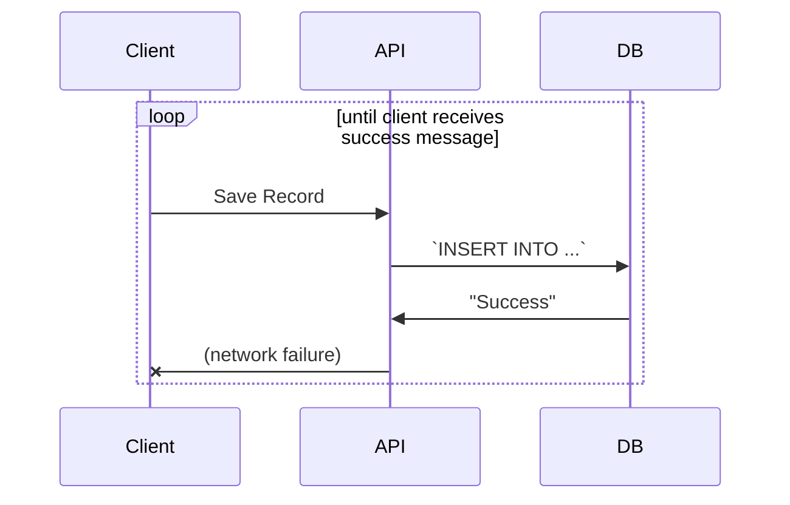

# Distributed systems

A **distributed system** is a set of software applications that implement [architectural patterns](software-architecture.md) to communicate via network and coordinate their actions to achieve a common goal.

## Core concepts of distributed systems

### Idempotence

An operation is **idempotent** when only the first received call can cause any change to the system. For example, when a file is saved with no changes the operation is idempotent if the save operation does nothing but it is not idempotent if the "modified" date is changed.

Idempotence is important in [distributed systems](distributed-systems.md) because retries may be necessary if system calls over the network fail. For example, if a "create" operation succeeds for a record in a database but the success message never reaches the client, the client has no way of knowing about the success and may therefore retry. If the "create" operation is not idempotent, this would undesirably result in the creation of duplicate objects.

### Immutability

[Data](data.md) is **immutable** when it can be created, but not destroyed (meaning modified or deleted). Immutability is valuable for parallel processing, as well as for business needs such as the need to generate detailed audit logs.

> Pat Helland's paper,  [Immutability Changes Everything](http://cidrdb.org/cidr2015/Papers/CIDR15_Paper16.pdf), goes into detail on the types of problems solved with immutability.

### Location independence

An application is **location independent** when its behavior does not rely on its location, meaning the same application can be deployed to multiple locations and when sent the same message will produce the same behavior as any other instance in any other location.

An example of location _dependence_ is the use of auto-increment IDs in [databases](databases.md) because the increment is only valid for the database that generated the ID and could identify a completely different record in another database. However, a GUID, natural key, or [content-addressed storage](content-addressed-storage.md)-based identifier (using a [hash](hash-functions.md)) is location _independent_ because it uniquely identifies the record, even across multiple database instances. Natural keys and content-addressed storage can be especially useful because they can be derived consistently regardless of location, whereas a GUID is randomly derived and therefore not consistently derivable.

### Data and API versioning

In the context of distributed systems, **versioning** is the practice of maintaining the contract between otherwise independent components of the system. In a distributed system, different versions of applications will be deployed to different locations at different times yet still need to interact successfully. A client application, for example, be routed to a newer version of an API that returns data in a newer format that what the client was originally built to process. Versioning helps maintain compatibility.

One simple versioning strategy is to use additive structure. **Additive structure** means that new elements are preferred over modifications to existing elements. In an API, this means preferring to add support for new structures to extend existing request/response objects. In a database, this means preferring to add new tables following the [snapshot pattern](snapshot-pattern.md) to extend existing entities.

## The eight fallacies of distributed computing

When it comes to distributed systems, [developers](software-engineering.md) often unknowingly make bad assumptions about the underlying risks and limitations to that system. Peter Deutsch famously listed seven of these assumptions in 1994 while at Sun Microsystems and James Gosling added another to the list in 1997. Collectively, these assumptions are now known as **the eight fallacies of distributed computing**.

> See also: [Episode 470L L. Peter Deutsch on the Fallacies of Distributed Computing](https://www.se-radio.net/2021/07/episode-470-l-peter-deutsch-on-the-fallacies-of-distributed-computing/) from Software Engineering Radio.

Those fallacies are:

1. The network is reliable
2. Bandwidth is infinite
3. The network is secure
4. Topology doesn't change
5. There is one administrator
6. Transport cost is zero
7. The network is homogeneous

<!--  TODO: Expand

### 1. The network is reliable

Example: Treat a web service call as a function call. Instead, assume the call may not make it to the service and the response may not make it back to the client.

### 2. Latency is zero

### 3. Bandwidth is infinite

### 4. The network is secure

### 5. Topology doesn't change

### 6. There is one administrator

### 7. Transport cost is zero

### 8. The network is homogeneous

Different versions of the same application may be deployed at different locations at different times.

-->

<!-- TODO: Articles in these areas

* CQRS, 
* Event storming
* Microservices

-->
