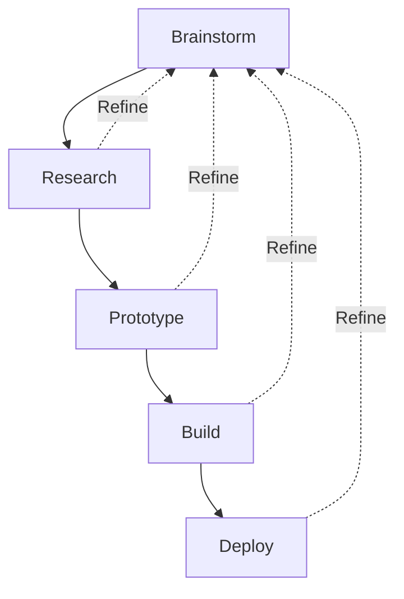

<!-- TODO: Tag engineering articles before removing draft: true -->

<!-- TODO: https://www.sciencebuddies.org/science-fair-projects/engineering-design-process/engineering-design-process-steps -->

# Engineering

**Engineering** is the application of science to create machines, processes, and tools that serve some intention.

## The Engineering Process

The **engineering process** consists of four stages: **Brainstorm**, **research**, **prototype**, and **build**. This process is iterative and the steps within one stage are may be completed in parallel with steps from another stage. Generally, however, the majority of effort is focused on one stage at a time.

Generally speaking, each stage is more expensive and risky than its predecessors. <!-- TODO: Pull in KSU talk content -->

### 🧠 Brainstorm

The **brainstorm** stage establishes the opportunity and preliminary scope for the product. The **opportunity** is the problem to be solved, the **scope** is what the product should and shouldn't do, and the **product** what is produced at the end of the engineering process to solve the problem. Brainstorming may start with a well defined problem, the simple desire to just make _something_, or anywhere in between. As issues and unexpected challenges arise in subsequent stages, the surest way to resolve them is to return to the brainstorming stage with the narrower opportunity and newly identified constraints.

1. Scenes - Where is the problem? Who experiences it? Why?
2. Problems - What could go wrong? What's difficult about it?
3. Solutions - How can the build prevent things from going wrong?

The result of the brainstorm stage is a general vision of what problem is being solved and a set of ideas that can be validated (i.e. a list of "things to try").

### 📚 Research

The **research** stage is where scope is defined. **Scope** is the refined set of requirements and constraints for the build. **Requirements** are what the build _must_ or _should_ do, and **constraints** are what the build _must not_ or _should not_ do.

1. What must/should the product do?
2. What must/should the parts/components of the product be?
3. What must/should the limitations of the product be?

As requirements and constraints are identified, conduct research by learning how others have solved similar requirements or dealt with similar constraints:

* On search engines
* In patents
* From colleagues

Result: Specifications = Requirements + Constraints + Experimental Results

#### 📝 Requirements 

When listing requirements, it can help to sort them into "essential" and "non essential" groups. Within each group, each requirement can be ranked to help focus on problem solving and later changes to the scope. Requirements only state what the build must or should do; they do not state _how_ it must be done. This is important because it leaves the final solution open to creative problem solving and optimization.

Once requirements are reasonably well defined, it's time to think about how each requirement can be met. For any given requirement, it's best to think of and research multiple solutions. Even solutions that seem non-viable now may prove insightful, or even essential, later on. Conversely, solutions that seem viable now may prove impractical with research; and it's much faster, easier, and cheaper to invalidate a solution with research than it is in a prototype, build, or deployment.

<!-- Todo: Requirements process diagram -->

#### Constraints

Constraints may be properties of the process or materials used, such as size, conductivity, or elasticity; or they may be limitations intentionally imposed on the build such as time, budget, or design (e.g. branding). Constraints often seed creativity. In a world of unlimited possibilities, _time_ can be one of the most useful constraints to apply. Time constraints, even when artificial, can force decisions to be made and foster creative solutions.

#### Experimentation

Some questions can't be answered by looking up information. These questions tend to be highly contextual to the product you're building and require experimentation to find answers.

1. Define the question and variables. **Independent variables** do not depend on other variables, whereas **dependent variables** will change when other variables change (for example, the height of a platform can be set independently but the time it takes an object to fall from that platform will _depend_ on the platform height). A well-designed experiment will keep all variables the same, except for a single independent variable.
2. Setup the experiment. Use the same materials you plan to use in the final product.
3. Run the experiment. Measure the outcome. Outcomes can be quantitative or qualitative. Quantitative outcomes are measurable by a discrete number (e.g. the amount of time it takes an object to fall from a platform). Qualitative outcomes are subjective or opinion based (e.g. which color is best?).

### Prototype

The **prototype** stage is a series of quick experiments designed to validate assumptions. A good prototype is cheap to build, easy to adjust one variable at a time, and as similar to the final product as possible.

#### Troubleshooting

When the prototype doesn't work or come together as expected, it's necessary to troubleshoot what went wrong. The steps to troubleshooting are:

1. Observe where the failure occurred. Sometimes this can be obvious, other times elements of the product need to be broken down into smaller and smaller parts.
2. Make a hypothesis about how to fix the failure.
3. Test the hypothesis.

This process is repeated until the issue is successfully resolved. 
