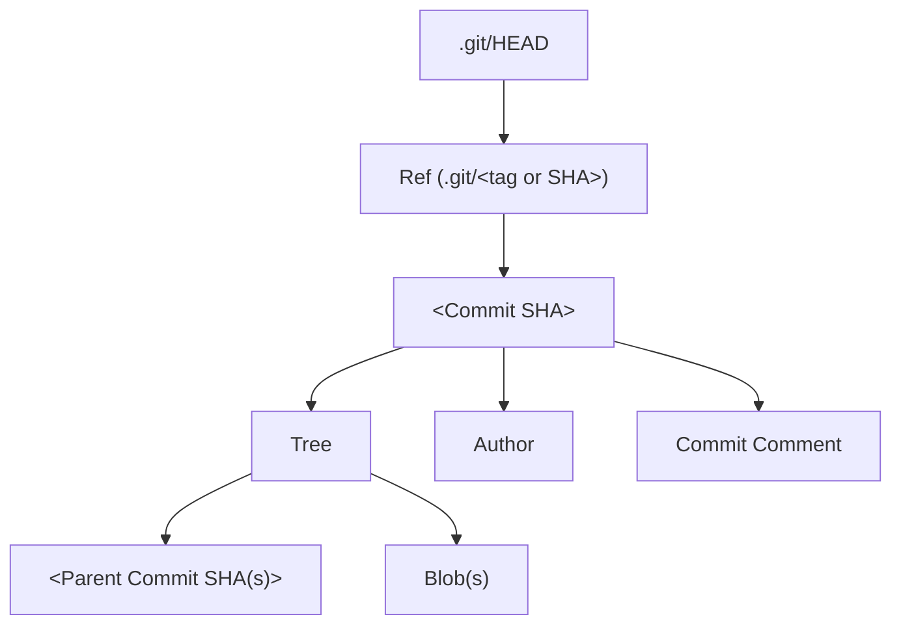

# Git Internals

Notes from "Git from the Ground Up" by [Safia Abdalla](https://safia.rocks/).

<iframe width="560" height="315" src="https://www.youtube.com/embed/afe0RpwaxY8" frameborder="0" allow="accelerometer; autoplay; clipboard-write; encrypted-media; gyroscope; picture-in-picture" allowfullscreen></iframe>

## Summary

* Git represents key information as objects stored on the files system
  * [`git cat-file`](https://git-scm.com/docs/git-cat-file) is useful for exploring these objects
* Git compresses loose objects into [packfiles](https://git-scm.com/book/en/v2/Git-Internals-Packfiles) to increase space efficiency (see also: [Packfiles: How Git Repositories Stay so Small](https://docs.google.com/presentation/d/1fitppu3XFqSq2Q5saXAy8QtUAm6vdQmKjuSsCz6HXRU/edit#slide=id.p))
* Rebases and merges differ in whether they give preference to maintaining a linear history or explicit  branches

## Types of Objects stored in `.git/`

**Blobs** represent file data.

**Trees** reference multiple blobs and other trees, similar to a directory structure.

**Commits** reference specific trees plus metadata, such as when the commit was made, the committer, and the commit message.

**Tags** are named commits.

Git objects have a type, size, and content.

## The `./git/HEAD` File

The `.git/HEAD` file contains a reference to a tag or SHA, which identifies a specific commit. The commit points to a Tree which contains one or more parents, plus

## Resources

* [Git Internals](https://git-scm.com/book/en/v2/Git-Internals-Plumbing-and-Porcelain)
