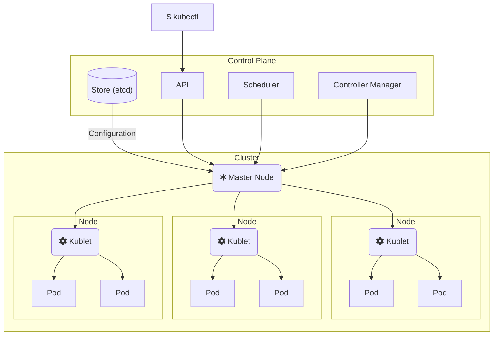
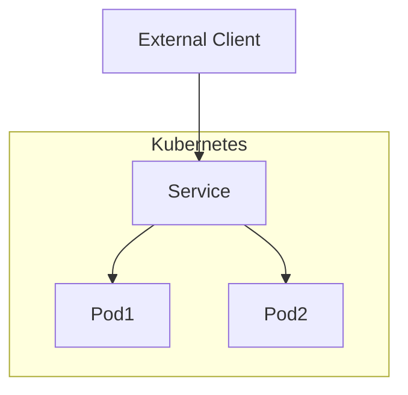

# Kubernetes (k8s)

**Kubernetes**, sometimes stylistically written as **k8s**, is an [open-source](open-source.md) system to automate the deployment, scaling, and management of [containerized](containers.md) applications. Kubernetes includes networking and storage abstractions to make it easy for deployments to be distributed across physical machine boundaries while maintaining the ability to communicate. Kubernetes provides the means to eliminate single points of failure, automatically scale, and to update containers without downtime through built-in services for service discovery, load balancing, automated roll-outs/roll-backs, self healing, and configuration management.

## How Kubernetes Works

Kubernetes works by maintaining a cluster of nodes, where each **node** is a physical or virtual machine capable of running one or more pods and managed by an agent called [kublet](https://kubernetes.io/docs/reference/command-line-tools-reference/kubelet/). A **pod** is a group of containers that share a common configuration and are scheduled onto the same node. Kubernetes is declaratively configured by a manifest file, which describes the desired state of the cluster. Differences between the desired state are reconciled through the **control plane**, which is an extensible set of components that are responsible for maintaining the desired state of the cluster.

<!--
## Components of Kubernetes

### Pods

Pods are the most basic unit of execution in Kubernetes. A **pod** is a group of containers that share a common configuration and are scheduled onto the same node. Pods are the smallest deployable unit of execution in Kubernetes.

### ReplicaSets

A **ReplicaSet** is a declarative way to maintain a set of pods that share a common configuration. Each pod in a ReplicaSet is a replica of all the other pods in that set, and the ReplicaSets creates and maintains the desired state of the pods. ReplicaSets act as a self-healing mechanism in that if a pod fails, the ReplicaSet will create a new pod to replace it. ReplicaSets provide fault tolerance and can also be used to automatically scale the number of pods horizontally based on a variety of conditions.

ReplicaSets rely on pod templates to define the desired state of the pods.

### Deployments

A **deployment** is a declarative way to manage ReplicaSets. Deployments support zero-downtime updates and rollbacks through the orchestrated creation and destruction of ReplicaSets.

### Labels

**Labels** are key-value pairs attached to pods, ReplicaSets, Deployments, and other Kubernetes objects to organize and identify those objects. Common uses for labels include identifying application names (e.g. "mysql"), versions (e.g. "5.7.21"), and instances (e.g. "mysql-production"), architectural components (e.g. "ui" or "database"), higher-level applications (e.g. "whenner"), and other application meta information.

### Services

A **service** allows an application to be exposed on a network, even as the pods that host the application are created and destroyed, by abstracting pod IP addresses away from application consumers and load balancing between active pods. Services rely on labels to to associate with pods.

There are four main types of Service:

* A **ClusterIP service** exposes the service on an IP address internal to the cluster so that only pods within the cluster can communicate with the service
* A **NodePort service** exposes the service on static port on each node's IP address so that the service is accessible from outside the cluster, the node then uses a ClusterIP service to proxy requests on that port to an appropriate pod
* A **LoadBalancer service** allocates an external IP address and integrates with an external load-balancer to automatically create routes to nodes (and pods by extension) exposed by a NodePort service
* An **ExternalName service** associates a service with a DNS name by returning a CNAME record on DNS lookup

### Storage and Volumes

### ConfigMaps and Secrets

Key-value pairs that can be used to store and retrieve configuration data.

-->
