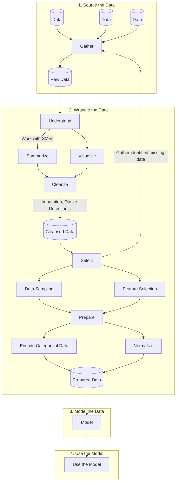

# Machine Learning (ML)

**Machine Learning (ML)** is the [science](data-science.md) of developing and applying algorithms that improve their output through experience; in other words, algorithms that can "learn".

## Machine Learning Terminology

| Word              | Definition                                                                                                                                                                                                           |
| ----------------- | -------------------------------------------------------------------------------------------------------------------------------------------------------------------------------------------------------------------- |
| Data sampling     | Systematic creation of smaller representative samples of larger data sets                                                                                                                                            |
| Feature           | A variable with high relevancy to the outcome variable                                                                                                                                                               |
| Feature selection | Automatic detection of variables most relevant to the outcome variable                                                                                                                                               |
| Imputation        | Correction of corrupt and missing values through inference                                                                                                                                                           |
| Integer encoding  | Assignment of an integer value to a categorical value, e.g. values "red", "green", and "blue" could be assigned integer values of 1, 2, and 3 respectively                                                           |
| One-hot encoding  | Assignment of a bit-mapped binary value to a set of categorical values, e.g. a "color" category with potential values of "red", "green", and "blue" could be mapped to three bits of 100, 010, and 001, respectively |
| Outcome variable  | The value to be predicted by a Machine Learning Model                                                                                                                                                                |
| Outlier           | A observation significantly different from other observations of the same data                                                                                                                                       |

## The Machine Learning Process

### 1. Source the Data

Work with Subject Matter Experts (SMEs) to identify and gather the relevant data sources.

### 2. Wrangle the Data

1. **Understand:** Defining the meaning and relationships for each field. Summary statistics, data visualizations, and guidance from SMEs are used to scrutinize the data.
2. **Cleanse:** Detect and address corrupt and missing data. Outlier detection and imputation are used to cleanse the data.
3. **Select:** Remove unneeded data from the data set, and gather missing data that cannot be reliably inferred. Data sampling is used to systematically create smaller representative samples of larger datasets and feature selection is used to automatically identify the variables most relevant to the outcome variable.
4. **Prepare:** Standardize and normalize the data into a consistent structure and format. Integer encoding and one-hot encoding are used to convert categorical data to numerical data to make it easier for a machine learning model to process.

#### Outlier Detection

The most common approaches to outlier detection are to use [standard deviation (STD)](standard-deviation.md) or [interquartile range (IQR)](interquartile-range.md).

The following steps are a simple example using standard deviation, but interquartile-range could be used just as easily:

1. Calculate the mean and standard deviation (alternatively, interquartile range) of the data collection
2. Set a cutoff ($c$) of three standard deviations ($\sigma$), or $c = 3\sigma$
3. Set a lower-bound ($l$) of the mean minus the cutoff ($l = \overline{x} - c$) and an upper-bound ($u$) of the mean plus the cutoff ($u = \overline{x} + c$)

All data points less than the lower-bound or greater than the upper-bound can be considered outliers.

#### Imputation Options

The basic options for imputation are to do nothing, remove records with missing/corrupt values, or replace the missing/corrupt values (usually with the mean or mode value), or some combination of these options. It's generally best to test each option and compare the outcomes to determine the best approach.

### 3. Model the Data

I'm still learning! This section will be updated as I learn. If you have a good resource to suggestion, please [tell me about it](https://github.com/jamestharpe/jamestharpe.com/issues/new).

### 4. Use the Model

I'm still learning! This section will be updated as I learn. If you have a good resource to suggestion, please [tell me about it](https://github.com/jamestharpe/jamestharpe.com/issues/new).

## Tools for Machine Learning

* [Azure Machine Learning](https://azure.microsoft.com/en-us/services/machine-learning/)
* [Pandas](https://pandas.pydata.org/)

## Machine learning resources

* [Hidden Technical Debt in Machine Learning Systems](https://proceedings.neurips.cc/paper/2015/file/86df7dcfd896fcaf2674f757a2463eba-Paper.pdf)
