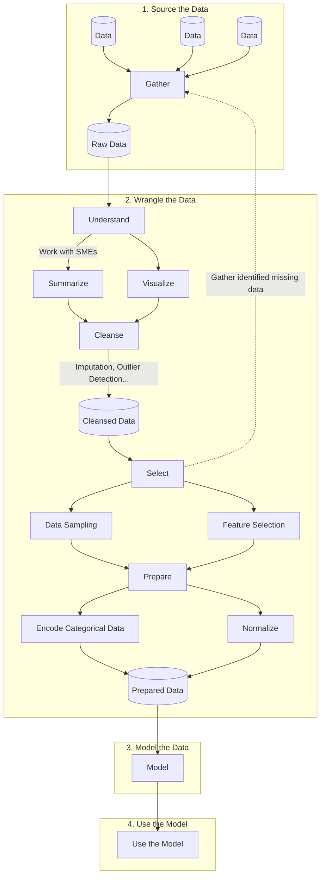

# Machine Learning (ML)

**Machine Learning (ML)** is the [science](data-science.md) of developing and applying algorithms that improve their output through experience by detecting patterns, making decisions, and predicting outcomes without being explicitly programmed to do so; in other words, algorithms that can "learn".

## Machine Learning Terminology

| Word              | Definition                                                                                                                                                                                                           |
| ----------------- | -------------------------------------------------------------------------------------------------------------------------------------------------------------------------------------------------------------------- |
| Data sampling     | Systematic creation of smaller representative samples of larger data sets                                                                                                                                            |
| Feature           | A variable with high relevancy to the outcome variable                                                                                                                                                               |
| Feature selection | Automatic detection of variables most relevant to the outcome variable                                                                                                                                               |
| Imputation        | Correction of corrupt and missing values through inference                                                                                                                                                           |
| Integer encoding  | Assignment of an integer value to a categorical value, e.g. values "red", "green", and "blue" could be assigned integer values of 1, 2, and 3 respectively                                                           |
| One-hot encoding  | Assignment of a bit-mapped binary value to a set of categorical values, e.g. a "color" category with potential values of "red", "green", and "blue" could be mapped to three bits of 100, 010, and 001, respectively |
| Outcome variable  | The value to be predicted by a Machine Learning Model                                                                                                                                                                |
| Outlier           | A observation significantly different from other observations of the same data                                                                                                                                       |

## The Machine Learning Process

## Machine learning resources

* [Hidden Technical Debt in Machine Learning Systems](https://proceedings.neurips.cc/paper/2015/file/86df7dcfd896fcaf2674f757a2463eba-Paper.pdf)
