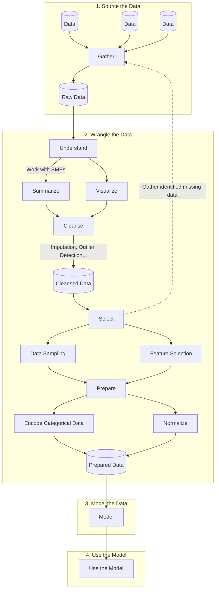

# Machine Learning (ML)

**Machine Learning (ML)** is an approach to [artificial intelligence](artificial-intelligence.md) that combines [statistics](statistics.md) and [data science](data-science.md) to develop and apply algorithms that improve their output through experience without being explicitly programmed to do so; in other words, algorithms that can "learn" to detect patterns, make decisions, and predict outcomes.

<!-- TODO:

Classification - Make a decision/prediction involving two or more categories or outcomes. e.g. accept/reject a loan

Regression - Predict an outcome based on one or more input variables. e.g. how much will a house sell for based on size, location, etc.

Clustering - Group objects together based on similarities in data. For example, identifying marketing segments based on customer demographics.

Anomaly detection - Find observations that are different than the "normal" data. e.g. a spike in negative social media comments after a new product release

Association learning - ...

Numeric estimation - ...

-----

Deep learning - a form of machine learning that stacks multiple ML models on top of each other to form a hierarchy. e.g. Face -> Gemoetric primitives -> Objects (eyes, nose, mouth) -> Faces -> Person name prediction

 -->

## Machine Learning Terminology

| Word              | Definition                                                                                                                                                                                                           |
| ----------------- | -------------------------------------------------------------------------------------------------------------------------------------------------------------------------------------------------------------------- |
| Data sampling     | Systematic creation of smaller representative samples of larger data sets                                                                                                                                            |
| Feature           | A variable with high relevancy to the outcome variable                                                                                                                                                               |
| Feature selection | Automatic detection of variables most relevant to the outcome variable                                                                                                                                               |
| Imputation        | Correction of corrupt and missing values through inference                                                                                                                                                           |
| Integer encoding  | Assignment of an integer value to a categorical value, e.g. values "red", "green", and "blue" could be assigned integer values of 1, 2, and 3 respectively                                                           |
| One-hot encoding  | Assignment of a bit-mapped binary value to a set of categorical values, e.g. a "color" category with potential values of "red", "green", and "blue" could be mapped to three bits of 100, 010, and 001, respectively |
| Outcome variable  | The value to be predicted by a Machine Learning Model                                                                                                                                                                |
| Outlier           | A observation significantly different from other observations of the same data                                                                                                                                       |

## The Machine Learning Process

## Machine learning model evaluation

Typically, when a machine learning model is trained, some portion of the training data is withheld for use in model evaluation.
The model is then used to predict the withheld data. The predictions are then compared to the actual values to derive an
**accuracy rate**, which represents the overall accuracy of the model, and an **error rate** which represents the number of "bad"
predictions made by the model.

Accuracy and error rates are useful; however, they treat all misclassifications as being equally bad. A **confusion matrix** plots the
misclassifications to provide more detail on model accuracy.

For example, we may have a [classification model](classification-learning.md) that predicts whether a user will "like" or "dislike"
a post on social media in which the model accurately predicts the user's input 60% of the time. The model therefore has a 60%
accuracy rate and a 40% error rate. The confusion matrix for this model might look something like the following table, illustrating that the
model performs better for predicting "dislike" classes than "like" classes.

<table>
	<tr>
		<td rowspan="2" colspan="3"></td>
		<th colspan="2">Predicted class</th>
	</tr>
	<tr>
		<td>Like</td>
		<td>Dislike</td>
	</tr>
	<tr>
		<th rowspan="2" colspan="2">Actual class</th>
		<td>Like</td>
		<td>3</td>
		<td>1</td>
	</tr>
	<tr>
		<td>Dislike</td>
		<td>3</td>
		<td>3</td>
	</tr>
	<tr>
		<th colspan="3">Accuracy</th>
		<td>50%</td>
		<td>75%</td>
	</tr>
</table>

## Machine learning resources

* [Hidden Technical Debt in Machine Learning Systems](https://proceedings.neurips.cc/paper/2015/file/86df7dcfd896fcaf2674f757a2463eba-Paper.pdf)
