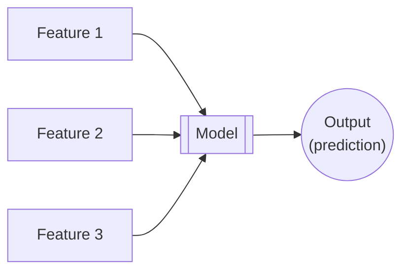

# Machine Learning (ML)

**Machine Learning (ML)** is an approach to [artificial intelligence](artificial-intelligence.md) that combines [statistics](statistics.md) and [data science](data-science.md) to develop and apply algorithms that improve their output through experience without being explicitly programmed to do so; in other words, algorithms that can "learn" to detect patterns, make decisions, and predict outcomes.

In it's simplest form, machine learning consists of several inputs, called features, a model, and an output that represents some sort of prediction.

An example of this is a spam filter: It takes inputs of an email's headers, subject, and body and determines whether the message is spam or not. A machine learning approach to spam detection will automatically learn new patterns with new data, making it difficult for spammers to defeat the filter except in the short-term. This is more efficient than traditional programming in which each rule would have to be developed by hand in response to new patterns as they emerge, allowing for longer periods between the emergence of a new pattern and a solution to detect it.

## What are features?

Inputs to a machine learning model are called **features** and consist of [statistical data types](statistical-data-types.md). Types of features include:

* **Numerical features**, sometimes called **quantitative features** are numbers. The n umbers may be either **discrete** (e.g. the number of votes in an election) or **continuous** (e.g. the volume of water in a glass).
* **Categorical features**, also known as **qualitative features**, consists of descriptive data that does not have a mathematical meaning. For example: Gender, color, and favorite food are all types of categorical data. Qualitative/categorical features are input into models using **one-hot encoding**.
* **Ordinal features** are a mix of categorical and numerical data, where the data fall into numerical categories. For example: a 5-points scale for product reviews.

## Types of machine learning

[**Supervised learning**](ml-supervised.md) uses labeled input, meaning the input model training data includes the output value to be predicted by the model. An example of supervised learning would be training a model to recognize animals by feeding it pictures of animals that are already labeled (e.g. dog, cat, giraffe...)

**Unsupervised learning** uses unlabeled input to find patterns within the data. For example, unsupervised learning might be used to identify market segments from existing customer data.

**Reinforcement learning** uses "rewards" and "penalties" in an interactive environment to train specific behaviors. An example of reinforcement learning is teaching a computer to play a video game.

<!-- TODO:

Clustering - Group objects together based on similarities in data. For example, identifying marketing segments based on customer demographics.

Anomaly detection - Find observations that are different than the "normal" data. e.g. a spike in negative social media comments after a new product release

Association learning - ...

Numeric estimation - ...

-----

Deep learning - a form of machine learning that stacks multiple ML models on top of each other to form a hierarchy. e.g. Face -> Gemoetric primitives -> Objects (eyes, nose, mouth) -> Faces -> Person name prediction

 -->

## Machine Learning Terminology

| Word              | Definition                                                                                                                                                                                                           |
| ----------------- | -------------------------------------------------------------------------------------------------------------------------------------------------------------------------------------------------------------------- |
| Data sampling     | Systematic creation of smaller representative samples of larger data sets                                                                                                                                            |
| Feature           | A variable with high relevancy to the outcome variable                                                                                                                                                               |
| Feature selection | Automatic detection of variables most relevant to the outcome variable                                                                                                                                               |
| Imputation        | Correction of corrupt and missing values through inference                                                                                                                                                           |
| Integer encoding  | Assignment of an integer value to a categorical value, e.g. values "red", "green", and "blue" could be assigned integer values of 1, 2, and 3 respectively                                                           |
| One-hot encoding  | Assignment of a bit-mapped binary value to a set of categorical values, e.g. a "color" category with potential values of "red", "green", and "blue" could be mapped to three bits of 100, 010, and 001, respectively |
| Outcome variable  | The value to be predicted by a Machine Learning Model                                                                                                                                                                |
| Outlier           | A observation significantly different from other observations of the same data                                                                                                                                       |

## The Machine Learning Process

## Machine learning resources

* [Hidden Technical Debt in Machine Learning Systems](https://proceedings.neurips.cc/paper/2015/file/86df7dcfd896fcaf2674f757a2463eba-Paper.pdf)
