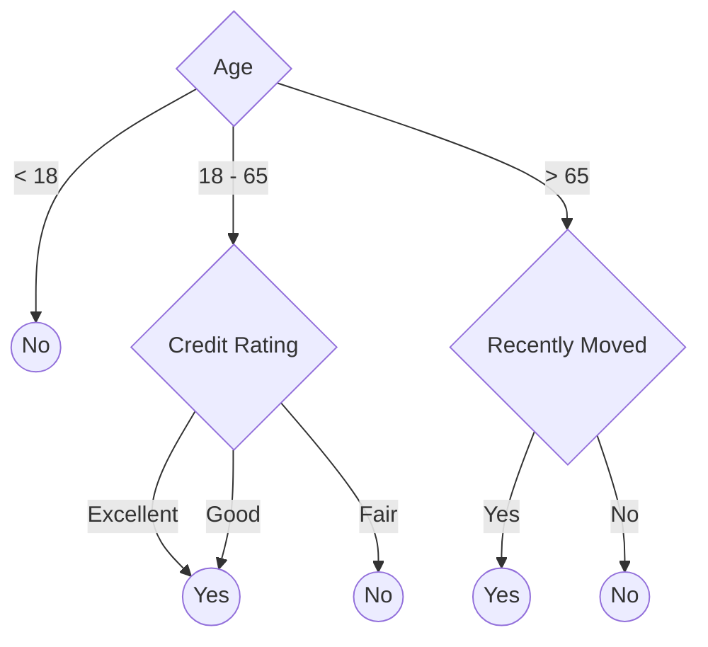

# Classification learning

**Classification learning** is a type of [supervised machine learning](ml-supervised.md) that classifies entities into two or more categories based on their characteristics. Classification models that predict between exactly two categories are called **binary classification** models. Models that predict among three or more categories are called **multi-class classification** models.

Classification learning works by giving a classification learning algorithm a set of training examples that have already been classified; the algorithm then produces a model that can be used to classify other, non-classified entities. Classification outputs predict a single, nominal attribute of each input entity. A **nominal attribute** is a label or classification that is mutually exclusive to the entity (it can have one and only one value).

A simple example of this would be to classifying whether a customer will buy a new mobile phone in the next year as a simple "yes" or "no" classification. The training data might look something like this (but with with thousands more records):

| id  | gender | age | recently moved | credit rating | buy a phone? |
| --- | ------ | --- | -------------- | ------------- | ---------- |
| 001 | m      | 41  | no             | excellent     | no         |
| 002 | f      | 36  | no             | excellent     | no         |
| 003 | f      | 22  | yes            | good          | yes        |
| 004 | n      | 20  | yes            | fair          | no         |
| 005 | f      | 27  | no             | fair          | yes        |
| ... | ...    | ... | ...            | ...           | ...        |

And the model produced could be a decision tree model, such as this:

