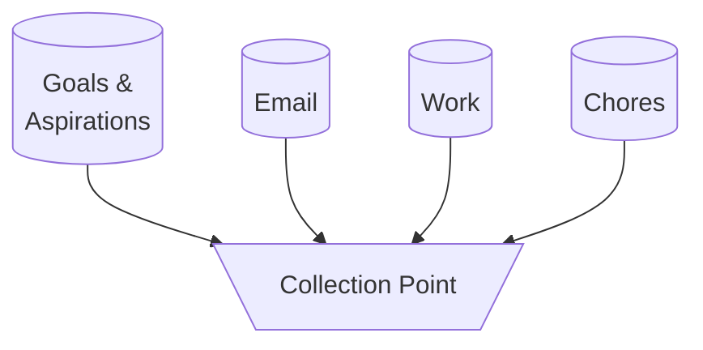

# Personal Productivity

**Personal productivity** is the practice of doing the right things and doing things right. Identifying the right things and knowing how to do things right requires motivation; when motivation fails, it requires discipline; when discipline fails, it require forgiveness.

## Start with the Person

Personal productivity starts with the person. To be productive: Eat well, sleep well, be mindful, and and exercise. Maintain these fundamentals in your everyday routine.

Each person has goals and aspirations. These are your starting point, write them down.

## Have a Collection Point

Tasks collect in many places - email, notepads, to-do apps, and so on. Settle on a single collection point to collect all tasks. The collection point can be an app, a spreadsheet, a notepad, whatever. For me, it's my [bullet journal](bullet-journaling.md).

> "Progress is made by lazy men looking for easier ways to do things."
>
> -- Robert A. Heinlein

## Triage at the Point of Collection

Use [4D Time Management](4d-time-management.md) to triage incoming tasks:

1. **Do it** right away, if you can
2. **Delegate it** if it's not important that _you_ do it
3. **Defer it** to a later date if you don't need to do it now
4. **Drop it** if it's unimportant

It can sometimes be hard to drop a task, even though it's not important. It sometimes helps to remember the advice, "don't put energy into things you don't want more of."

## Have a Daily Routine

[Design a daily routine](daily-routine.md) to be the engine of progress toward your goals. Changes in routine are best done in small increments. Not every waking moment must be dedicated to some maniacal vision of success as we often see in "productivity porn" and "hustle culture". Build in self-care: It's okay to take breaks and recharge. Willpower is a reservoir that has to be replenished.

<!-- TODO: Break out articles for the below sections to keep this article as an overview -->

## Have a Planning & Prioritization Cycle

Use daily, weekly, monthly, and annual cycles to make small, medium, and large adjustments to your plans and priorities. In each cycle, eliminate non-critical work and break-down large tasks into smaller ones. Not much gets done while you're sleeping, so generally try break large tasks down into tasks that can be done in less than one day.

* On a **daily** basis, take 5-10 minutes to list the few most important tasks you'd like to accomplish that day. At the end of the day, do a 5-10 minute review to cross-off anything that's been completed or has become irrelevant.
* On a **weekly** or **monthly** basis, take an hour or two to set some medium-sized goals that will get you "one step closer" to your long-term aspirations. Break the bigger tasks into smaller tasks, or schedule time to plan them out more thoroughly. [Triage](4d-time-management.md) left-over tasks from the previous week or month.
* On an **annual** basis, take a few days to a week to reflect on progress from the last year and to set expectations for the next. Drop those big ideas you won't realistically get around to so you can free-up the mental space to tackle everything else.

A popular planning and prioritization cycle is the **rule of three** from from **Getting Results the Agile Way** by J.D. Meier: Write down three outcomes for each day, each week, and each year.

Another common cycle is "Monday vision, Friday reflection" where you set out a list of intentions for the week on Monday, then reflect on what got done (or not) each Friday.

## Seek Satisfaction, Avoid Guilt

Satisfaction comes from progress and recognition, so measure what you can and share your journey. Keep a journal, a blog, a spreadsheet - whatever will help you see that your system is working.

It's natural to feel guilty when you fail to meet a commitment, fall short of a goal, or resume a habit you were trying to break. Yet you can own your failures without guilt. Define your mistake, forgive yourself for it, and adjust your plans to reality.

Ways to avoid guilt:

* Don't set self-defeating goals. For example, don't expect yourself to go from "I haven't exercised in years" to "I'm going to exercise every day!" over night
* Indulge with intention. Build self-care into your routine - you won't feel bad if you zone out in front of the TV because you planned to take a necessary mental break
* Say no. When there's more to do than you can handle, all you can do is less. Saying "no" reduces mental burden.
* Be deliberate. Being overtly busy is usually the result of non-deliberate action.

> "Being busy is a form of laziness - lazy thinking and indiscriminate action."
>
> -- Tim Ferriss

## Disrupt Overwhelm

When feeling overwhelmed we often regress toward our most unproductive but emotionally satisfying habits. This is doubly disappointing: not only do these habits take time away from the overwhelming amount of work we need to accomplish, they often reverse progress we've made.

It can help to have a plan of action to free up time and focus where we need to focus most. Here's a plan I got from [Scott Hanselman's Talk on Personal Productivity](https://www.youtube.com/watch?v=RpH6IPhyh7I&list=WL&index=3):

1. Identify streams of data and write them down (be specific. e.g. write "Facebook", not "Social Media")
2. Sort them by signal vs. noise
3. Draw a line and drop everything below the line until no longer overwhelmed

"Drop" can mean anything from "just ignore it" to "have my friend change my password and only give me the new one after a month" or even "delete my account".

### Tips for Reducing Overwhelm

* Everything important will persist until it has found its way to you. Don't worry if you miss it.
* Where applicable, automate the response. For example, set up an auto-response in email that you won't be answering for a while.

### Example List of Data Streams

Here's my list of data streams, with the best signal-to-noise ratio at the top:

* Work email
* Calendar notifications
* Slack
* Text messages

--- Way too much on my plate, drop everything below this line ---

* Feedly
* Google Hangouts
* Twitter
* Phone Calls
* Personal Email

--- Starting to get stressed, drop everything below this line ---

* TikTok
* Reddit
* Facebook
* Postal Mail
* Voicemail

## Additional Productivity Tips and Tricks

* Combine TV, audio books, podcasts, and other passive forms of entertainment with working out
* Turn on your phone's "Do not Disturb" or airplane mode during Focus Time
* Turn off phone notifications on an app-by-app and person-by-person basis (set non-favorites to not ring the phone - Google it!)

## Personal Productivity Resources

* [Scott Hanselman - Personal Productivity](https://www.youtube.com/watch?v=RpH6IPhyh7I&list=WL&index=3)
* [43 Folders System](https://officedynamics.com/43-folders-method-paper-system/)
* [Hipster PDA](http://www.43folders.com/2004/09/03/introducing-the-hipster-pda)
* [The Common Denominator of Success by Albert Gray](http://amnesta.net/mba/thecommondenominatorofsuccess-albertengray.pdf)
