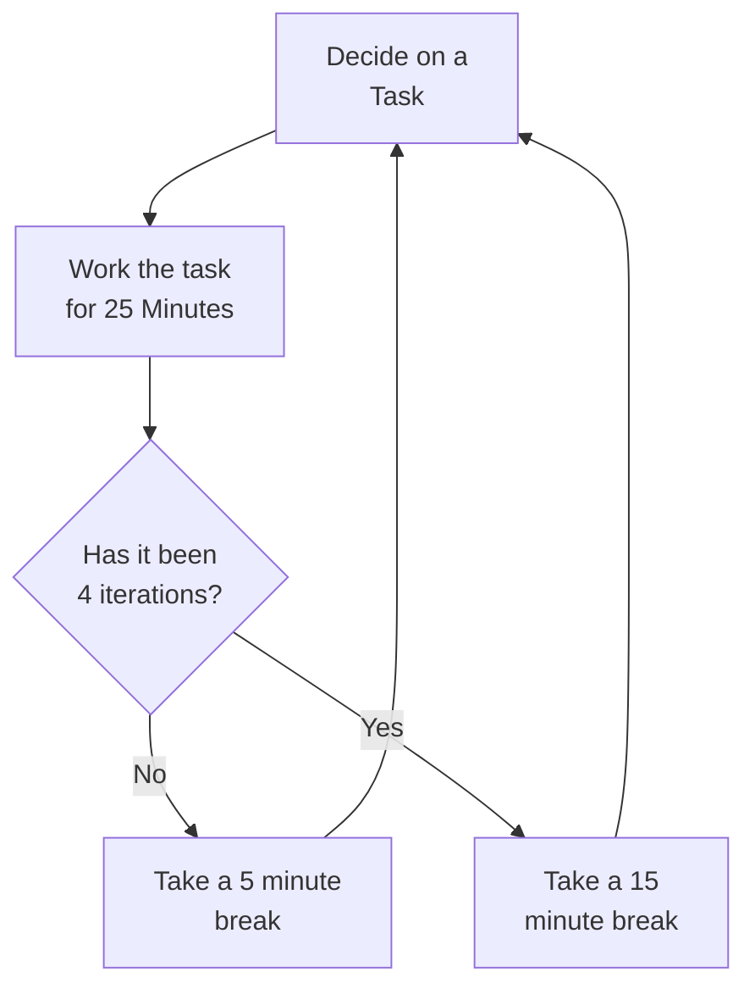

import PomodoroTimer from "../src/components/pomodoro-timer"

# The Pomodoro Technique

## Pomodoro Timer

<PomodoroTimer />

The **Pomodoro Technique** is a simple but effective technique for time management that uses short [timeboxes](timeboxing.md) and frequent breaks. It is an especially useful way to get through drudgery, reduce procrastination, and increase focus.

Here's how it works:

1. Decide on a task
2. Set a timer for 25 minutes
3. Work on the task until the time goes off
4. Take a break for 5 minutes
5. Go back to step one

After four cycles (about two hours), take a longer break of about 15 to 30 minutes.

## Tips for Effective Pomodoros

* Avoid distractions: Silence your phone, close your door, and so on
* Keep a notepad to record other tasks that come to mind
* Adjust the times to suit your needs and tasks
* If you're "in the zone" when it's break time, keep going!
* Move your body during breaks: Do a quick stretch, go for a walk, etc.

## Animated Video: The Pomodoro Technique - A Study and Productivity Technique

<iframe width="560" height="315" src="https://www.youtube.com/embed/AYR-RuGwJbM" title="YouTube video player" frameborder="0" allow="accelerometer; autoplay; clipboard-write; encrypted-media; gyroscope; picture-in-picture" allowfullscreen></iframe>
