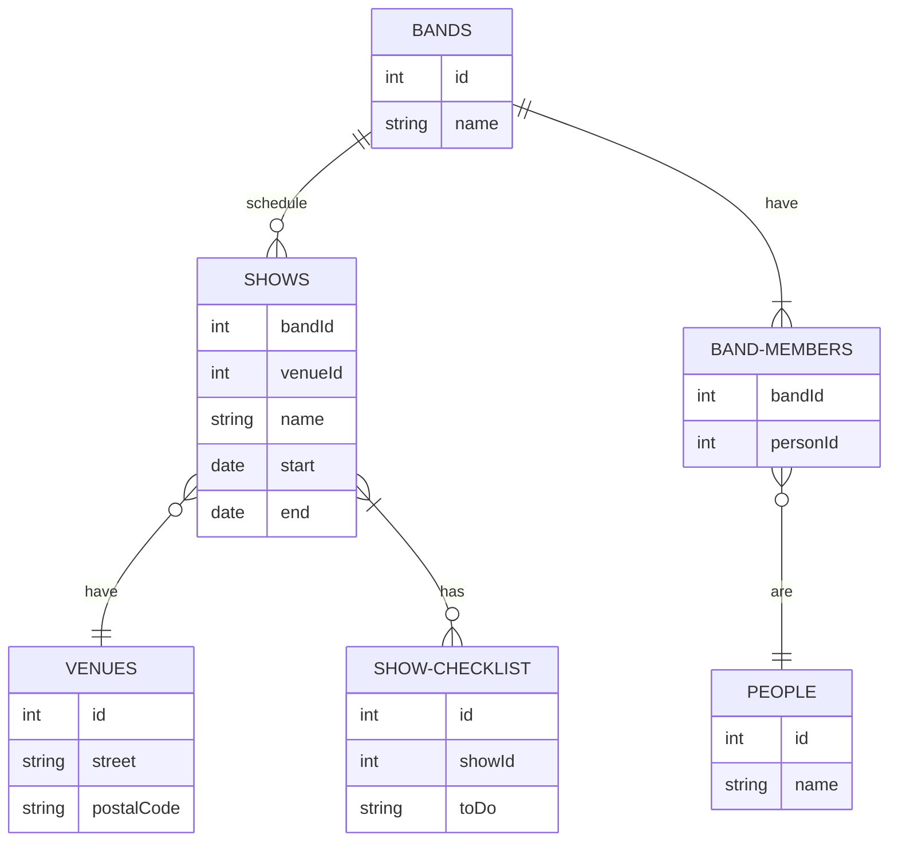
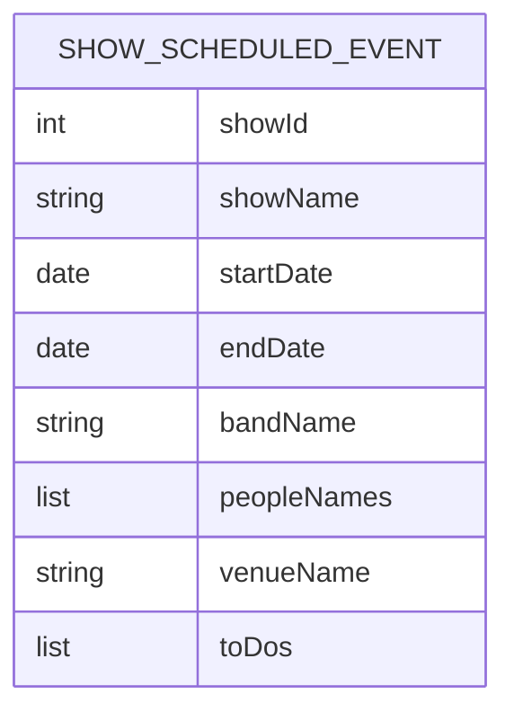
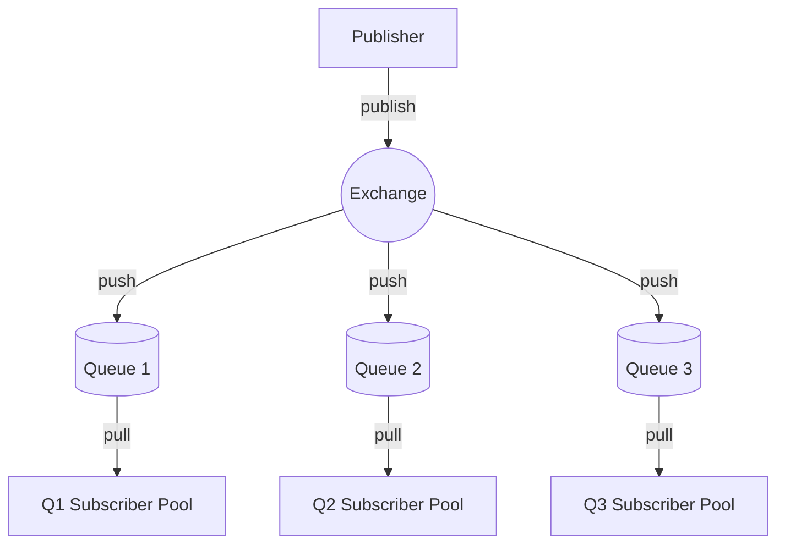

# Publish/subscribe pattern (pub-sub)

The **publish/subscribe pattern (pub-sub)** is a [software engineering](software-engineering.md) [design pattern](swe-design-patterns.md) used commonly in [distributed systems](distributed-systems.md) to communicate asynchronously and parallelize tasks across applications, [data pipelines](data-pipelines.md), and [services](microservices.md) in a decoupled way.

Events are usually published by a single publisher and consumed by multiple subscribers. **Publishers** are systems of record applications that publish events while **subscribers** consume and process events. Publishers generally publishes events without regard to how or when subscribers will process them. **Events** are simply records of "something that happened" (e.g. "customer added", "order placed", and so on).

## Designing event models

For events to be useful, they must carry enough information for subscribers to process them successfully. Given that it's impractical, and maybe impossible, to foresee all the potential subscribers of an event, it's useful to take a methodical approach to event model design.

One such approach is to use a [**transitive closure**](transitive-closure.md) which calculates the relationships that would need to be added between entities to directly (as opposed to indirectly) associate related data. For example, take the following relational schema used to book musical acts at various venues:

To generate an "show scheduled" event, we need to determine what information a subscriber would need to know whenever an event is booked. We can calculate that by identifying all of the _direct and indirect_ relationships to the `SHOWS` entities and then demoralize them into the event structure.

The first step is to follow the relationships _from_ the `SHOWS` table. In this case, we see that a show is defined by the associate BAND and VENUE entities, thus some data from the `BANDS` and `VENUES` records are likely to be useful to consumers of the "show scheduled" event. However, to `BANDS` have `BAND-MEMBERS` which have `PEOPLE`, thus it likely makes sense to include data from these entities as well.

The second step is to follow the relationships _to_ the `SHOWS` table. In this case, we see that each SHOW can have zero or more CHECKLIST items, thus some data from the `SHOW-CHECKLIST` is likely to be useful as well.

Finally, with all the required information identified, we can design a reasonable schema for the "show scheduled" event:

Though this can seem excessive or a violation of [YAGNI](yagni.md) because this data can be looked up with only the `id` of the added `SHOWS` entity, it's not. Such lookups can create excessive "chatter" that actually consumes more network, storage, and compute cycles than the larger payload would tend to save. There is also the risk that the underlying data changes between when the event was published and when it was processed, leaving subscribers with inaccurate data about the event _when it occurred_.

Finally, this level of de-normalization can reduce dependence on message order. If, for example, we relied on the "venue created" event to be processed _before_ the "show scheduled" event, ensuring the messages are processed in sequence can add complexity and reduce scalability.

## Subscriber patterns

### Competing consumer pattern

The **competing consumer pattern** organizes subscribers by type to simplify how services scale. When there are multiple types of subscribers, each events should be consumed by all types of subscriber. However, when there are multiple instances of a single type of subscriber then each event should only be consumed by a single subscriber instance.

To manage this distinction, subscribers can be grouped into exchanges. An **exchange** is a message queue that serves a single type of subscriber. This allows the system to scale based on the workload (i.e. queue size) and avoid redundant event processing.

Each subscriber in the subscriber pool pulls from the same queue, ensuring each message is only processed once.

### Commutative message handling <!--TODO: https://lispcast.com/what-is-commutativity-and-why-is-it-so-useful-in-distributed-systems/ ? -->

**Commutative message handling** is a desirable property of subscribers where the order in which messages are processed doesn't matter, similar to algebraic property (i.e. $a + b = b + a$). Though message queues typically deliver messages in the order they were received, message processing may error out and have to be retried as later messages are successfully processed, or a later message may simply get processed faster than an earlier message.

Messages of the same type can be made commutative by attaching a timestamp to the event. For example, if an "venue description changed" event is processed out of order, it could cause the subscriber to revert its venue description to the older version. However, if the event includes a timestamp and the stored data is newer than the message timestamp, then the message can be safely discarded.

Messages of different types can be made commutative by storing related information as it arrives. For example, if a show is scheduled for a venue and then the venue description is changed, we can't know for sure that the related messages will be processed in that order. Thus, if the "venue description changed" event is processed before the "show scheduled" event (even though it happened afterward), we could process stale venue when the "show scheduled" event is processed. To prevent this, the venue data should _also_ be saved by the subscriber, along with the timestamp. Then when the "show scheduled" event is processed, the timestamp can be compared to the timestamps for related data and only "new" information processed.
