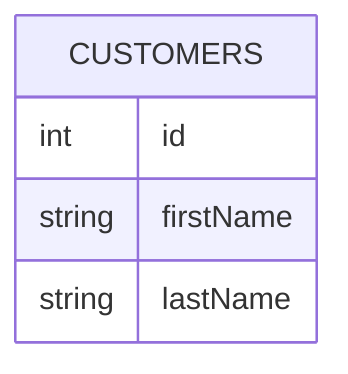
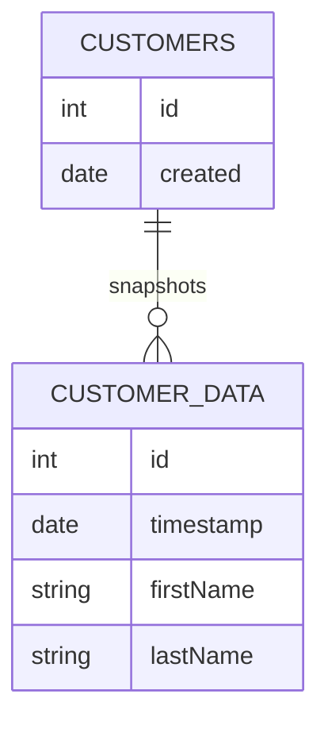

# Snapshots design pattern

The **snapshots design pattern** is [software engineering](software-engineering.md) [design pattern](swe-design-patterns.md) for immutable [database](databases.md) updates. Snapshots are implemented by externalizing record data into one or more tables and modifying records by inserting new data rather than replacing old data. For immutable deletes, see [the tombstone pattern](tombstone-pattern.md).

## Example snapshot implementation

Take a typical `CUSTOMERS` table that _does not_ implement the snapshots pattern:



Retrieving and updating records in the `CUSTOMERS` table is easy, _however updates destroy the data that was previously stored_:

```SQL
-- Retrieve a customer:
SELECT firstName, lastName 
FROM CUSTOMERS
WHERE id = 1

-- Update a customer, but lose the original value for firstName!
UPDATE CUSTOMERS
SET firstName = 'James'
WHERE id = 1
```

Using the snapshots pattern, we move the customer data to a new, timestamped table:



Retrieving and updating customers is now a bit trickier, but in exchange for this added complexity we get a complete record of all changes ever made to each customer's data:

```SQL
-- Retrieve customer data via INNER JOIN:
SELECT CUSTOMER_DATA.firstName, CUSTOMER_DATA.lastName FROM CUSTOMERS
INNER JOIN CUSTOMER_DATA ON CUSTOMER_DATA.id=CUSTOMERS.id
WHERE CUSTOMERS.id = 1
ORDER BY timestamp DESC
LIMIT 1

-- "Update" the customer's data
INSERT INTO CUSTOMER_DATA 
	(id, timestamp, firstName, lastName) 
VALUES 
	(1, strftime('%s','now'), "James", "Tharpe")
```
