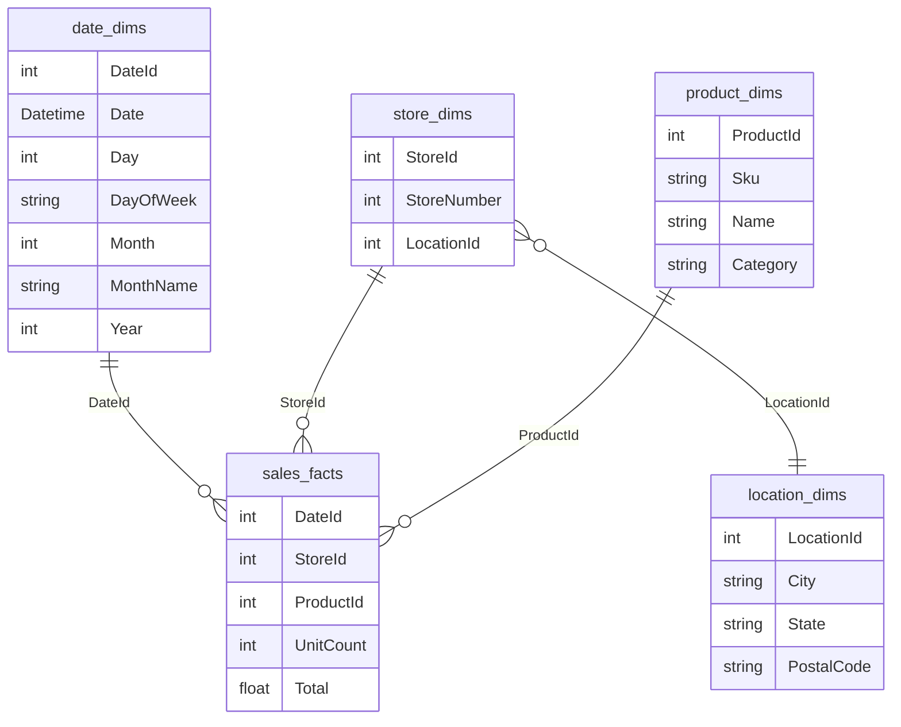

# Snowflake schemas

A **snowflake schemas** extends a [star schema](star-schemas.md) to normalize dimension tables by breaking them into additional tables.

```mermaid
erDiagram
	sales_facts {
		int DateId
		int StoreId
		int ProductId
		int UnitCount
		float Total
	}

    date_dims ||--o{ sales_facts : DateId
	store_dims ||--o{ sales_facts : StoreId
	store_dims }o--|| location_dims: LocationId
	product_dims ||--o{ sales_facts : ProductId

	date_dims {
		int DateId
		Datetime Date
		int Day
		string DayOfWeek
		int Month
		string MonthName
		int Year
	}

	store_dims {
		int StoreId
		int StoreNumber
		int LocationId
	}

	location_dims {
		int LocationId
		string City
		string State
		string PostalCode
	}

	product_dims {
		int ProductId
		string Sku
		string Name
		string Category
	}
```
