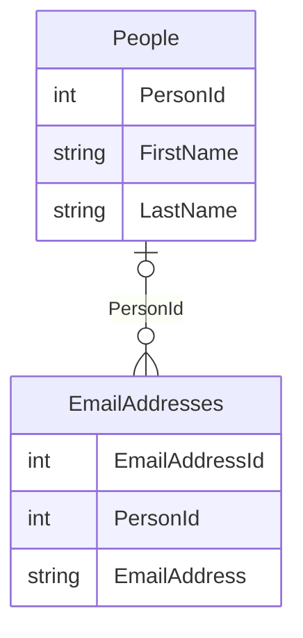

# SQL `JOIN` clauses

A [SQL](sql.md) **`JOIN` clause** merges multiple tables into a single resultset. For these demos, we'll use the following schema:



## `INNER JOIN`

An `INNER JOIN` matches column values across tables and only returns data where the specific match was found, typically by mapping a primary key to a foreign key.

```sql
SELECT
	People.FirstName,
	People.LastName,
	EmailAddresses.EmailAddress,
FROM
	People
INNER JOIN
	EmailAddresses ON People.PersonId = EmailAddresses.PersonId

-- Sample output --
/*
FirstName	| LastName 	| EmailAddress
---------------------------------------
Micky		| Mouse		| micky.mouse@disney.com
*/
```

In this example the row for Micky Mouse in the `People` table was matched with a row from the `EmailAddresses` table through the `PersonId` key.

## `OUTER JOIN`

An `OUTER JOIN` works similarly to an `INNER JOIN` except that it will include results where no match was found by returning `null` values for columns in the unmatched second table.

### `FULL OUTER JOIN`

A `FULL OUTER JOIN` returns all rows from both tables (with `null`s for unmatched results):

```sql
SELECT
	People.FirstName,
	People.LastName,
	EmailAddresses.EmailAddress,
FROM
	People
FULL OUTER JOIN
	EmailAddresses ON People.PersonId = EmailAddresses.PersonId

-- Sample output --
/*
FirstName	| LastName 	| EmailAddress
---------------------------------------
Micky		| Mouse		| micky.mouse@disney.com
Donald		| Duck		| null
null		| null		| mysterious@address.com
*/
```

In this example:

* The row for Micky Mouse in the `People` table was matched with a row from the `EmailAddresses` table through the `PersonId` key.
* The row for Donald Duck in the `People` table was returned, but the email address was `null`because there was no match in the `EmailAddresses` table through the `PersonId` key
* The row for the `mysterious` email address in the `EmailAddresses` table was returned, but the `FirstName` and `LastName` were `null` because there was no match in the `People` table through the `PersonId` key

### `LEFT OUTER JOIN`

A `LEFT OUTER JOIN` will return all rows from the left table with `null` for non-matching right side table rows:

```sql
SELECT
	People.FirstName,
	People.LastName,
	EmailAddresses.EmailAddress,
FROM
	People
LEFT OUTER JOIN
	EmailAddresses ON People.PersonId = EmailAddresses.PersonId

-- Sample output --
/*
FirstName	| LastName 	| EmailAddress
---------------------------------------
Micky		| Mouse		| micky.mouse@disney.com
Donald		| Duck		| null
*/
```

* The row for Micky Mouse in the `People` table was matched with a row from the `EmailAddresses` table through the `PersonId` key.
* The row for Donald Duck in the `People` table was returned, but the email address was `null`because there was no match in the `EmailAddresses` table through the `PersonId` key

### `RIGHT OUTER JOIN`

A `RIGHT OUTER JOIN` will return all rows from the right table with `null` for non-matching left side table rows:

```sql
SELECT
	People.FirstName,
	People.LastName,
	EmailAddresses.EmailAddress,
FROM
	People
LEFT OUTER JOIN
	EmailAddresses ON People.PersonId = EmailAddresses.PersonId

-- Sample output -- 
/*
FirstName	| LastName 	| EmailAddress
---------------------------------------
Micky		| Mouse		| micky.mouse@disney.com
null		| null		| mysterious.email@address.com
*/
```

In this example:

* The row for Micky Mouse in the `People` table was matched with a row from the `EmailAddresses` table through the `PersonId` key.
* The row for the `mysterious` email address in the `EmailAddresses` table was returned, but the `FirstName` and `LastName` were `null` because there was no match in the `People` table through the `PersonId` key
