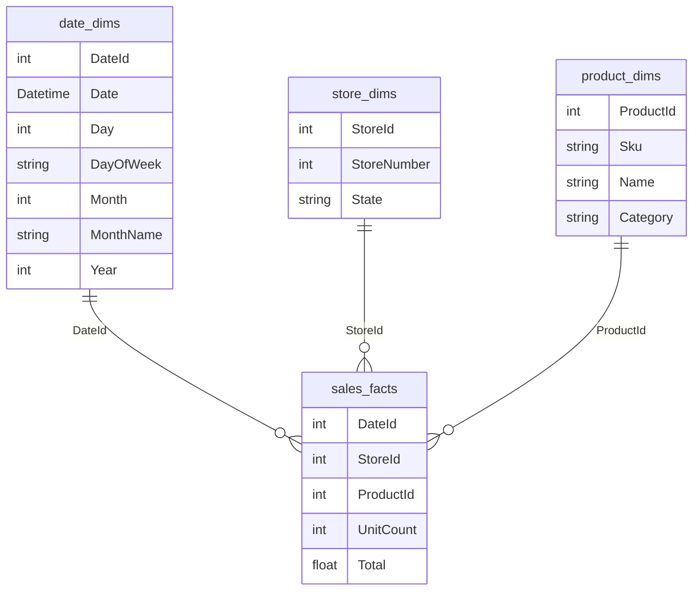

# Star schemas

A **star schemas** is a specific implementation of a [dimensional model](dimensional-modeling.md) that organizes [relational data](relational-databases.md) into fact and dimension tables, typically to store data in a [data warehouse](data-warehouses.md).  In a typical star schema, there is one central **fact table** that contains all of the data related to a particular business process (such as sales, support request, defect reports, etc.), and several **dimension tables** that contain descriptive information about the various dimensions that are used to analyze that process (such as time, location, and product). The fact table and dimension tables are joined together using foreign keys to create a complete picture of the data.

## Example start schema for Sales

Here's a simple example of a star schema, organized around sales:



This allows reports to be easily built. For example, to calculate TV sales by brand and year using [SQL](sql.md):

```sql
SELECT
	date_dims.Year,
	product_dims.Brand,
	SUM(sales_facts.UnitCount) as TotalUnitsSold
FROM sales_facts
	INNER JOIN date_dims ON (sales_facts.DateId = date_dims.DateId)
	INNER JOIN store_dims ON (sales_facts.StoreId = store_dims.StoreId)
	INNER JOIN product_dims ON (sales_facts.ProductId = product_dims.ProductId)
WHERE 
	product_dims.Category = 'TV'
GROUP BY
	product_dims.Brand,
	date_dims.Year
ORDER BY
	date_dims.Year,
	product_dims.Brand,

-- Sample output -- 
/*
Year	| Brand 	| TotalUnitsSold
---------------------------------------
2020	| Panasonic	| 123
2020	| Samsung	| 121
2020	| Sony		| 234
2021	| Panasonic	| 271
2021	| Samsung	| 90
2021	| Sony		| 115
*/
```

## Types of fact tables

### Transaction Fact Tables

**Transaction fact tables** contain the lowest level of detail available and are the most common type of fact table. Each row in a transaction fact table captures a single event (e.g., a click on a web page) and link to all available dimensions for that event.

### Periodic snapshot fact tables

**Periodic snapshot fact tables**, or simply **snapshot fact tables**, summarize measurements for a given time period (e.g. hourly, daily, etc.). Snapshot fact tables contain pre-aggregated measures that can be derived from transaction fact tables. Examples of periodic snapshot fact tables include hourly snapshots of clicks on a webpage, daily sales, and monthly account balances.

### Accumulating snapshot fact tables

**Accumulating snapshot fact tables** capture key milestones in a given [business process](business-operations.md) to simplify [analysis](data-analysis.md) of time between each step of the process. For example, an accumulating snapshot fact table for the checkout process of an e-commerce website might store one row for every user and mark the key steps (when the cart was reviewed, when shipment information was provided, when payment was provided, etc.).

<!-- 
## Types of dimensions

### Slowly changing

A **slowly changing dimension** represents data that that will change slowly over time. For example, a customer address dimension is unlikely to change frequently and thus is a slowly changing dimension. There are three major types of slowly changing dimension table:

* **Type one:** Changes are not stored. For each identifier, there is only one record. Any changes to the record overwrite the original.
* **Type two:** Complete history is stored. For each identifier, there may be multiple records and therefore a surrogate key is typically introduced. Each record typically includes a start and end date to indicate the time period for which the record is considered "current". Any changes to a record are inserted as new records.
* **Type three:** Partial history is stored. As with a type two slowly changing dimension table (type two SCD), there may be multiple records and therefore require a surrogate key, start date, and end date. However, changes to records require additional logic to remove old records; this logic generally deletes older records based on  (for example, delete everything older than one year) or based on storing a maximum number of records (for example, delete anything older than the 5th record).

### Conformed

A **conformed dimension** is a dimension that is related to more than one fact and therefore has the same meaning across the entire data model.

### Degenerate

A **degenerate dimension** is a dimensions stored in the same row as its the associated fact, without referencing a separate dimension table. For example, an "invoice number" dimension stored in a `sales_facts` table and used to group transactions together is considered a degenerate dimension.

### Junk

A **junk dimension** is a very dimension (without many details) that is stored in the same table as other junk dimensions to reduce the number of tables in the schema. Junk dimensions tend to have a limited number of values, such as true/false or yes/no, or simple statuses such as high/medium/low or shipped/in-route/delivered/returned. Examples of junk dimensions include: Gender, shipping status, and satisfaction rating (1-5 stars).

### Role-playing

### Static

### Shrunken
-->

## Star schema modeling resources

* [Kimball Dimensional Modeling Techniques](https://www.kimballgroup.com/data-warehouse-business-intelligence-resources/kimball-techniques/dimensional-modeling-techniques/)
* [GitLab Enterprise Dimensional Model](https://about.gitlab.com/handbook/business-technology/data-team/platform/edw/)
