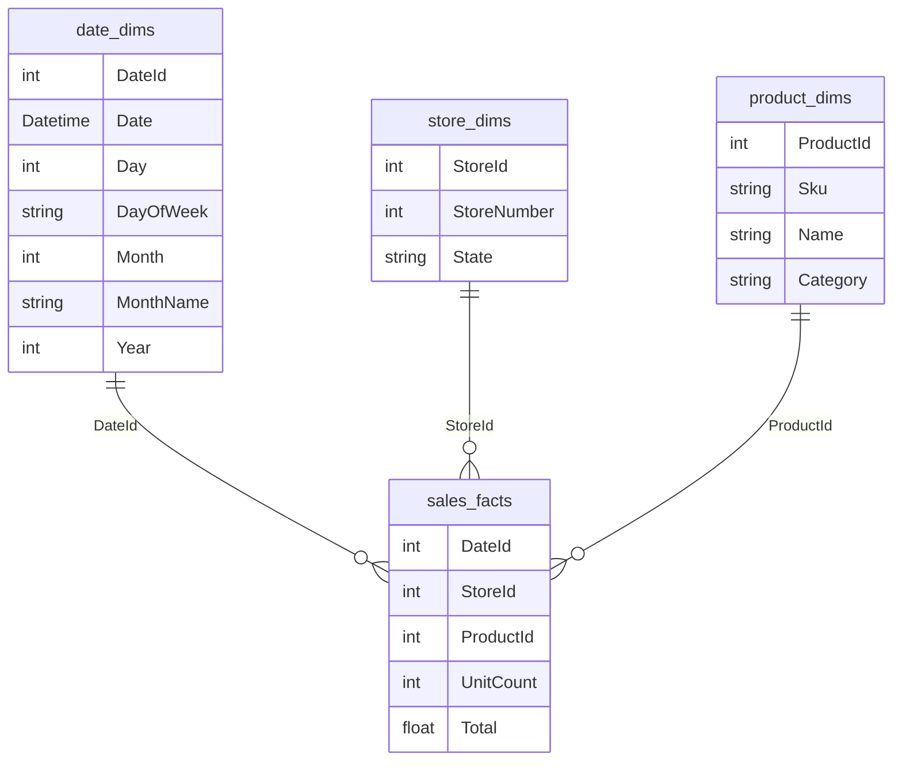

# Star schemas

A **star schemas** organizes [relational data](relational-databases.md) into fact and dimension tables, typically to store data in a [data warehouse](data-warehouses.md). **Fact tables** consist of measurements and metrics (e.g. sales) while **dimension tables** consist of related data that can be used for filtering and categorization (e.g. which products were sold). Dimension tables that related to multiple fact tables are called **confirmed dimension tables**.



This allows reports to be easily built. For example, to calculate TV sales by brand and year using [SQL](sql.md):

```sql
SELECT
	date_dims.Year,
	product_dims.Brand,
	SUM(sales_facts.UnitCount) as TotalUnitsSold
FROM sales_facts
	INNER JOIN date_dims ON (sales_facts.DateId = date_dims.DateId)
	INNER JOIN store_dims ON (sales_facts.StoreId = store_dims.StoreId)
	INNER JOIN product_dims ON (sales_facts.ProductId = product_dims.ProductId)
WHERE 
	product_dims.Category = 'TV'
GROUP BY
	product_dims.Brand,
	date_dims.Year
ORDER BY
	date_dims.Year,
	product_dims.Brand,

-- Sample output -- 
/*
Year	| Brand 	| TotalUnitsSold
---------------------------------------
2020	| Panasonic	| 123
2020	| Samsung	| 121
2020	| Sony		| 234
2021	| Panasonic	| 271
2021	| Samsung	| 90
2021	| Sony		| 115
*/
```
