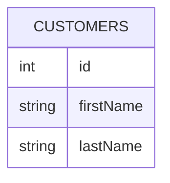
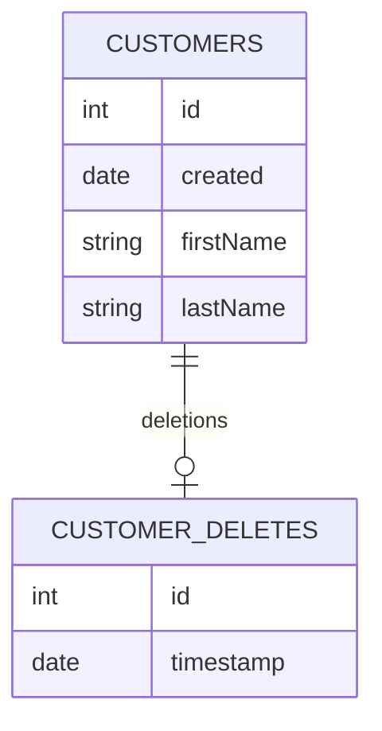

# Tombstone design pattern

The **tombstone design pattern** is [software engineering](software-engineering.md) [design pattern](swe-design-patterns.md) for [insert-only database](insert-only-databases.md) deletes. Deletions are implemented by recording each deletion in a deletion table. For immutable updates, see [the snapshot pattern](snapshot-pattern.md).

## Example tombstone implementation

Take a typical `CUSTOMERS` table that _does not_ implement the tombstone pattern:



Retrieving and deleting records in the `CUSTOMERS` table is easy, _however deletes destroy the data that was previously stored_:

```SQL
-- Retrieve a customer:
SELECT firstName, lastName 
FROM CUSTOMERS
WHERE id = 1

-- Update a customer, but lose the original value for firstName!
DELETE FROM CUSTOMERS
WHERE id = 1
```

Using the tombstone pattern, we move the customer data to a new, timestamped table:



Retrieving and deleting customers is now a bit trickier, but in exchange for this added complexity we preserve the original customer data:

```SQL
-- Retrieve customer data via INNER JOIN:
SELECT CUSTOMERS.created, CUSTOMERS.firstName, CUSTOMERS.lastName
FROM CUSTOMERS
LEFT JOIN CUSTOMER_DATA ON CUSTOMER_DATA.id = CUSTOMERS.id
WHERE CUSTOMER_DATA.id IS NULL


-- "Delete" the customer data
INSERT INTO CUSTOMER_DELETES
	(id, timestamp) 
VALUES 
	(1, strftime('%s','now'))
```
